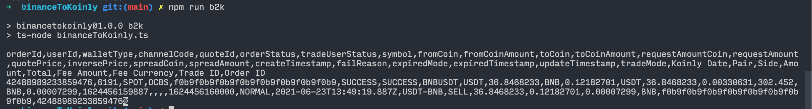

# Bitaroo To Koinly

A tool to convert your trades data in Bitaroo to a Koinly formatted CSV for simple importing into Koinly.

## Disclaimer

I could have totally messed this conversion up. It's on **you** if the data it outputs into Koinly is wrong. I recommend you only work with a single data point for testing purposes, to confirm this tool actually works as expected. I also recommend you double check output data before even attempting to use it with Koinly. This was just a hobby project for me because f\*\*\* Binance for making it too hard to export your own data. ✊ It was coded late at night, so don't be surprised if there are mistakes.

You have been warned.

## Getting the data yourself

With that being said, let's have some fun.

https://reports.bitaroo.com.au/trades

You will need the json payload returned from https://www.binance.com/bapi/margin/v1/private/new-otc/query-trade-history?startTime=1619791200000&endTime=1624975199999&page=1&rows=20

To get this:

1. Log into Binance and visit https://www.binance.com/en/my/orders/convert/history
2. open up chrome devtools then go to the network tab.
3. Set some start/end dates, click the "Search" button.
   > Note: the date picker only lets you select up to 90 days of data. If you adjust the timestamps and make the api call using something like Postman, this restriction does not exist and you can get all your data in one go. Presumably Binance want to limit how much you hammer their servers, the poor diddumz.
4. Right click on the network request and select `Copy` > `Response`.
5. Then paste into the 'binanceData.json' file in the same folder as this file.

## Running the code

Simply:

```shell
npm run b2k
```

Manually copy the converted data format that has been spat out in the terminal to your clipboard. I wasnt bothered trying to automatically pipe the data into a csv, more hassle than it was worth. Maybe some day. Probably not.

> Important: The end of the output seems to have an erroneous `%` added to it. Not sure why. Make sure not to copy that into your CSV file or large poopey action may happen to your CSV import to Koinly.



```shell
touch conversions.csv
```

Then finally paste your clipboard into conversations.csv and save. You can then import it into Koinly. ☘️

# 🚬😎🤌
